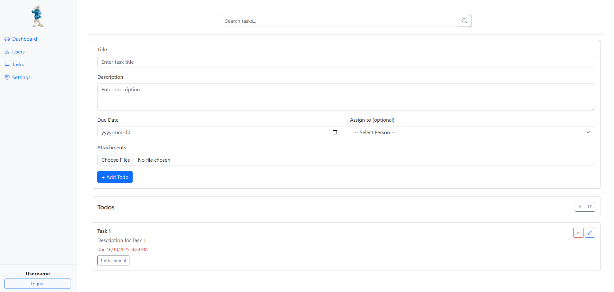

Todo Dashboard workshop

Project Features

Sidenav:

❌ No functionality: The sidenav does not have any interactive features.

✅ Responsive: It automatically hides on small screens to improve mobile usability.

Form:

✅ Fully implemented: The form is completely functional.

✅ Todos: You can create, update, delete, and complete todos.

Search:

✅ Complete: The search feature is fully implemented and operational.

Sorting:

❌ Not implemented: The sorting functionality has not been added yet.

